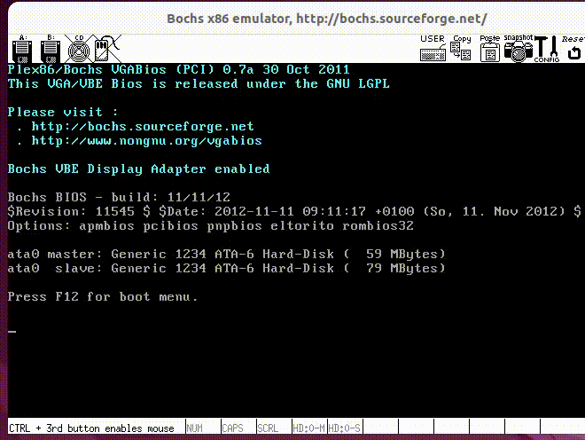

> 参考《操作系统真象还原》和Linux早期源码 ，从零到一实现一个类Unix小型操作系统。

# 特性：

- **引导程序**：使用汇编语言编写MBR引导程序，实现从BIOS到保护模式的切换，完成内核的加载与初始化
- **内存管理**：实现物理内存分页管理，设计位图算法跟踪内存页状态，支持动态内存分配与回收
- **进程调度**：实现基于时间片轮转的进程调度器，支持多任务并发执行，实现进程上下文切换的汇编级代码
- **驱动管理**：编写中断控制器驱动程序，注册中断处理函数，支持处理时钟中断、键盘中断等硬件事件
- **文件系统**：实现一个简易类ext2文件系统，支持文件创建、读写及目录管理功能。封装系统调用接口，实现简易shell进行系统交互

# 效果展示：

# 使用指南：

(环境配置：bochs2.6.2+gcc3.4+nasm2.15.05)

### 1.克隆到本地

~~~bash
git clone https://github.com/lance-e/loong-OS.git
~~~

### 2.编译

~~~bash
make build
~~~

### 3.将内核写入镜像文件

~~~bash
make hd
~~~

### 4.运行

使用bochs虚拟机运行操作系统 (注意：不支持arm架构)

~~~bash
bin/bochs
~~~

# 贡献：

欢迎pr或issue。
